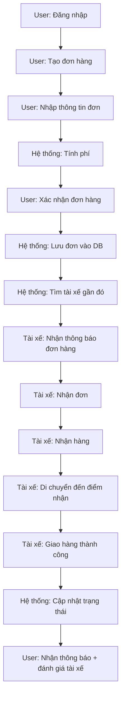

# 🚚 Hệ thống giao hàng - Luồng hoạt động & Use Case
> Ngày tạo: 2025-04-11

---

## 🔁 Luồng hoạt động: Đặt hàng và giao hàng

---

## ✅ Use Case: Giao hàng đơn giản

| Mục               | Nội dung |
|--------------------|---------|
| **Use Case ID**     | UC001 |
| **Tên Use Case**    | Đặt đơn hàng giao |
| **Mô tả**           | Người dùng tạo đơn hàng để gửi đến một địa điểm khác |
| **Tác nhân chính**  | Người dùng (User) |
| **Tác nhân phụ**    | Tài xế (Driver), Hệ thống |
| **Điều kiện bắt đầu** | Người dùng đã đăng nhập thành công |
| **Luồng chính**     | 
1. Người dùng tạo đơn hàng  
2. Nhập thông tin: địa chỉ gửi, nhận, loại hàng  
3. Hệ thống tính phí giao hàng  
4. Người dùng xác nhận đơn  
5. Hệ thống lưu đơn hàng vào DB  
6. Hệ thống tìm tài xế phù hợp và gửi thông báo  
7. Tài xế nhận đơn hàng  
8. Tài xế đến điểm gửi, lấy hàng  
9. Tài xế giao hàng đến điểm nhận  
10. Hệ thống cập nhật trạng thái  
11. Người dùng nhận thông báo hoàn tất và đánh giá |
| **Điều kiện kết thúc** | Đơn hàng được đánh dấu là "Đã giao" và người dùng đánh giá tài xế |
| **Luồng thay thế** | 
- Nếu không có tài xế, đơn hàng chuyển vào trạng thái “Chờ tài xế”  
- Nếu tài xế từ chối đơn, hệ thống chuyển đơn đến tài xế khác |

---

